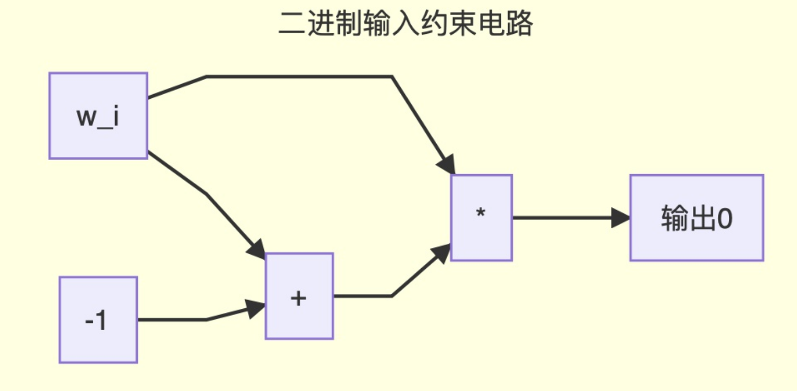

# Range Proof

假如我们有一个数字w，我们想要证明这个数字w不是一个负数，那么我们可以先办法证明它一定会取值于正整数区间。因为考虑到计算机系统里的正整数一般不会超过256位，所以我们可以把问题弱化一下：**证明一个数字w取值于0-2^256之间。**（根据此条件，有限域选择的质数p需要大于2^256。）

![[公式]](https://www.zhihu.com/equation?tex=w+%5Cin+%5C%7B0%2C...%2C2%5E%7B256%7D%5C%7D+%5C%5C)

当我们在讲一个值n会取值在0和1之间的时候，我们用![[公式]](https://www.zhihu.com/equation?tex=n+%5Ccdot+%28n+-+1%29+%3D+0)来约束这个取值范围。**同理可得，如果我们想约束![[公式]](https://www.zhihu.com/equation?tex=n)必须要取值于0和2^256之间的话，我们就可以用更长的一串乘法来约束它**。但是这样最后的电路里面将会有**2^256个乘法门**。光是这么多乘法，还没有算加法，这个电路的复杂度已经是天文数字了。就算是跑Setup可能就不知道跑到猴年马月，所以我们说这种约束的方法是**不实际的**。

既然我们想要规定w是个整数，并且大于0但小于2^256，那么我们就可以在二进制里，**把w拆分成256位，然后分别约束每一位**。这样的话，我们最后得到的电路大小只会和这个数字有多少位成正比，而不会和这个数字的最大上限有关系。复杂度一下子就下来了一大个等级。

这个约束需要256份，每一份对应每一位。当我们把这些约束准备好之后，我们最后确定所有的位组在一起可以还原成原来的w：

![[公式]](https://www.zhihu.com/equation?tex=2%5E0+w_0+%2B+2%5E1+w_1+%2B+...+%2B+2%5E%7B255%7D+w_%7B255%7D+-+w+%3D+0+%5C%5C)

