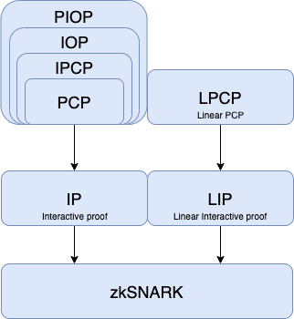
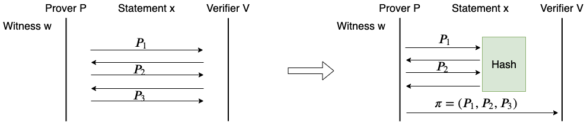
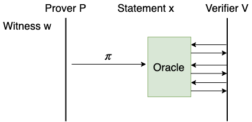
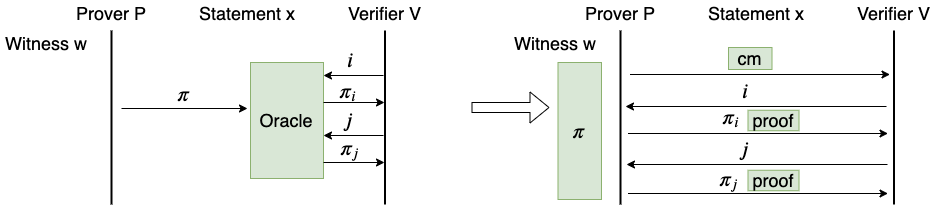
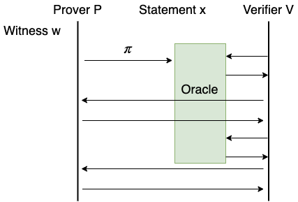
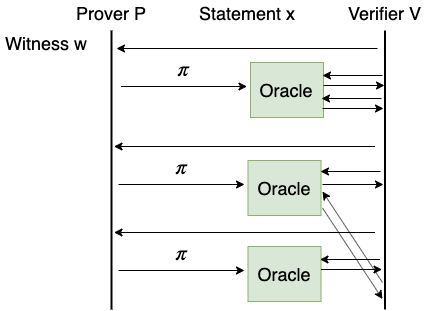
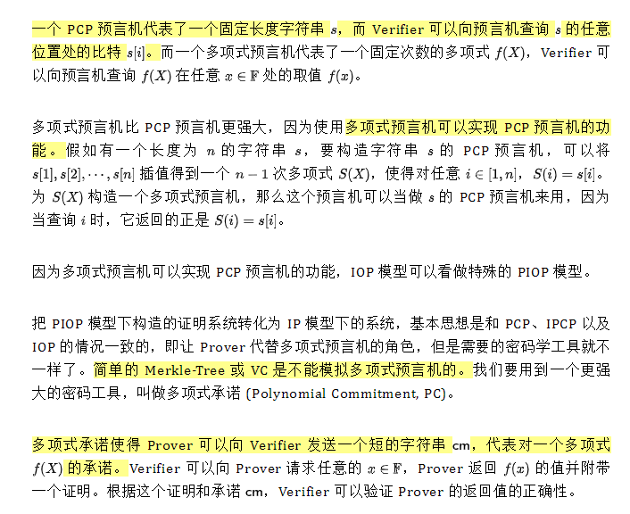
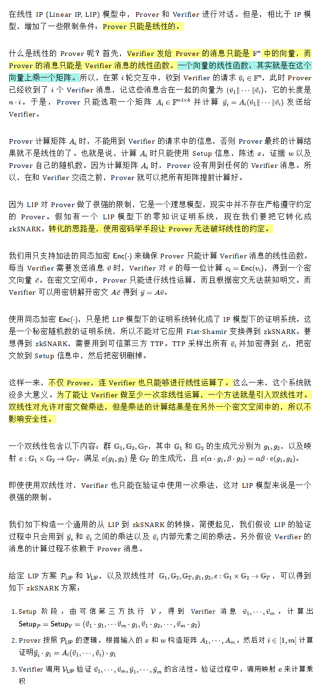
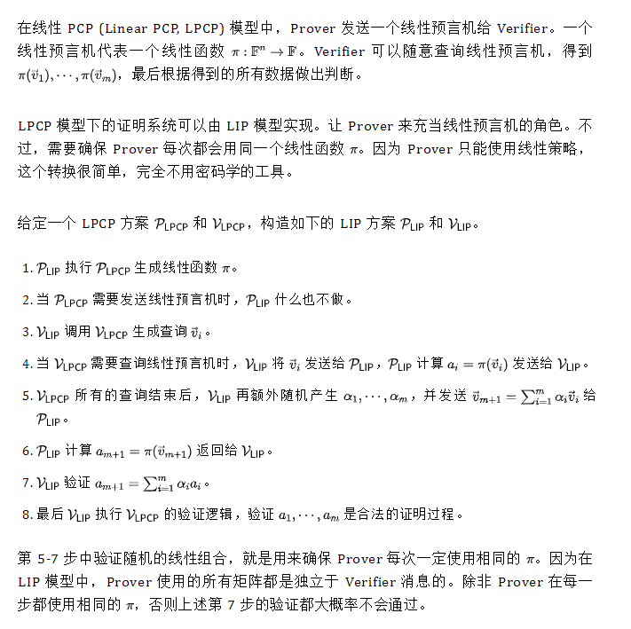

# ZKSNARK的基本构造

## 布尔电路和算术电路

1. 布尔电路处理的是布尔值，算术电路处理的是有限域 中的元素；
2. 布尔电路的门是逻辑门，算术电路中的门是加法门和乘法门；
3. 算术电路对涉及到代数运算的计算逻辑更友好

##  ZKP 常用的理想模型

### IP

站在 zkSNARK 的场景看，交互系统就是一个理想模型，因为它提供了一个场景中不存在的理想功能，即 Verifier 可以向 Prover 发送消息。

**交互系统到非交互系统的转换——Fiat-Shamir 变换**

假如我们已经有了一个交互系统，包括两个算法 P_IP 和 V_IP ，分别是 Prover 和 Verifier 的算法。现在要构造非交互系统的两个算法 P_zkSNARK 和 V_zkSNARK 。核心思想是，让 Prover 在自己的脑海中虚拟出一个 Verifier。 P_zkSNARK 调用 P_IP 完成全部的计算，只有在需要 Verifier 消息时，才调用虚拟的 Verifier 产生一条 Verifier 消息。P_zkSNARK 独自执行完成整个交互系统，然后构造一个证明字符串，发送给 V_zkSNARK 。V_zkSNARK 根据这个证明字符串，精确恢复 P_zkSNARK 自导自演的交互过程，然后按照 V_IP 的逻辑验证这个过程。

我们只考虑公开随机数的证明的转换。公开随机数的证明是指，Verifier 的所有消息都是均匀随机字符串。此时 P_zkSNARK 可以使用哈希函数 Hash 来模拟 Verifier 消息。具体做法如下：

1.  P_zkSNARK 初始化 T 为空字符串
2.  P_zkSNARK 执行 P_IP 的逻辑。每当 P_IP 需要发送消息时， P_zkSNARK 将要发送消息添加到 T 上
3. 每当 P_IP 需要 Verifier 消息时，P_zkSNARK 计算 Hash(T) 作为这一步的 Verifier 消息
4.  P_IP 的逻辑执行结束后， 包含了全部的 Prover 消息
5.  P_zkSNARK 把 T 作为证明字符串发送给 V_zkSNARK
6.  V_zkSNARK 调用 Hash 从 T 计算出所有的 Verifier 消息，从而恢复出完整的交互流程
7.  V_zkSNARK 按照 V_IP 的逻辑验证这个交互流程

上述方法就叫做 Fiat-Shamir 变换。**Fiat-Shamir 变换只能将公开随机数的交互证明转化为非交互证明**，所以，接下来的理想模型中，只能考虑构造公开随机数的 ZKP。

### PCP

**随机可查证明 (Probabilistically Checkable Proof, PCP)**

在 PCP 模型中，Prover 构造一个证明字符串，叫做 PCP 证明。**PCP 证明的长度可以非常长**，远远超过 Verifier 的计算能力。所以，Prover 不会直接把 PCP 证明发送给 Verifier，而是**向 Verifier 发送一个预言机 (Oracle)**，叫做 PCP 预言机。Verifier 可以随意查询 PCP 预言机，获取 PCP 字符串任意位置的比特。

为了理解 IP 和 PCP 的关系，我们举一个现实中的例子。我们请上我们熟悉的主人公 Alice 和 Bob。假设 Alice 是一名即将毕业的研究生，Bob 的任务是评审 Alice 的课题是否合格。IP 模型就是答辩，Alice 和 Bob 直接对话，如果 Alice 能成功回答 Bob 的所有提问，Alice 就成功毕业了。而在 PCP 模型中，没有答辩，Alice 只是把毕业论文发给 Bob，而毕业论文超级长，Bob 不可能看完论文，只能在论文中随机挑选几段来读，如果挑的这些段落都没有问题，相互之间逻辑通顺，Bob 就相信 Alice 的课题是合格的。

PCP 预言机提供了这样的功能：它本身很短，传递它只需要很小的通信量；它传递的信息量却很大，通过它可以随机访问一个很长的字符串。**显然，真正的 PCP 预言机是不存在的，PCP 是一个理想化的模型。**

假如我们构造了一个 PCP 模型下的证明系统，包括两个算法 P_PCP 和 V_PCP ，分别是 Prover 和 Verifier 的算法，可以将它转化为 IP 模型下的证明系统，包括两个算法 P_IP 和 V_IP 。这个转化又要用到哈希函数 Hash。

1.  P_IP按照 P_PCP 的计算过程生成 PCP 证明字符串

2. 当 P_IP 需要发送 PCP 预言机的时候， P_IP 调用 Hash 在字符串 S 上构造一个 Merkle-Tree，并将 Merkle-Tree 的根 rt 发送给 V_IP

3.  V_IP 按照 V_PCP 的逻辑进行验证

4. 每当 V_PCP 需要访问 PCP 预言机的时候，V_IP 把要查询的索引 i 发送给 P_IP

5.  将 Merkle-Tree 的第 i 个叶子的值 v ，连同其 Merkle-Path path 发送给 V_IP

6.  V_IP 使用 rt 和 path 验证 v ，如果验证通过，就将 v 作为 PCP 预言机的返回值继续执行 V_PCP 的逻辑

7. 最后，V_IP 输出和 V_PCP 一样的结果

   

上述过程中的 Merkle-Tree 可以用更一般的密码学组件**向量承诺 (Vector Commitment, VC)** 来代替。VC 使得 Prover 可以向 Verifier 发送一个短的字符串 cm ，代表对一个向量的承诺，而 Verifier 可以令 Prover 展示出这个向量中的任意位置的值，并提供合法性证明，证明的长度远小于向量的长度。实际上，Merkle-Tree 就是一个简单的 VC 实现。

### IPCP

IPCP (Interactive PCP) 模型可以看做 IP 模型和 PCP 模型的相加。在 IPCP 模型中，Prover 向 Verifier 发送了 PCP 预言机后，Prover 和 Verifier 继续进行交互。交互过程中，Verifier 可以不时地访问 PCP 预言机。

继续使用上一节中 Alice 和 Bob 的例子。如果说 IP 模型是只有答辩，PCP 模型是只有毕业论文，那么 IPCP 模型就是在 Alice 答辩之前把毕业论文发给 Bob。在答辩过程中，Bob 可以一边看毕业论文一边向 Alice 提问。

基于 IPCP 模型构造的证明系统也可以通过 Merkle-Tree 或一般的 VC 方案转化成 IP 模型下的证明系统，过程和 PCP 模型的转换完全一样，区别仅在于，Verifier 在查询 PCP 证明的请求中可能夹杂着普通的交互。

IP 模型和 PCP 模型都可以看做是特殊的 IPCP 模型。其中，IP 模型相当于在 IPCP 模型中 Prover 发送一个空预言机给 Verifier。PCP 模型相当于在 IPCP 中省略掉 Prover 和 Verifier 的对话环节。

### IOP

如果说 IPCP 模型是把 IP 和 PCP 模型做加法，那么 IOP (Interactive Oracle Proof) 模型就是把 IP 和 PCP 做乘法。在 IOP 模型中，Verifier 向 Prover 发送消息，而 Prover 则向 Verifier 发送 PCP 预言机。Verifier 可以随意查询 Prover 发过的任何 PCP 预言机。

继续使用前面 Alice 和 Bob 的例子来解释 IOP 模型。Alice 把毕业论文发给 Bob，Bob 给 Alice 回复一个简短的评论意见，然后 Alice 再写一篇论文发给 Bob，Bob 再回复，这样来回进行多次。这个过程中，Bob 可以随时阅读 Alice 发给过他的任何一篇论文，当然 Bob 的时间仍然不够，Bob 仍然只能随机选取一小部分阅读。最后，Bob 判断 Alice 的课题是否合格。

和 PCP、IPCP 一样，在 IOP 模型下构造的证明系统也可以类似转化成 IP 模型下的证明系统。

IPCP 模型可以看做特殊的 IOP 模型。在 IPCP 模型中，把对话环节的 Prover 消息都看做一个 PCP 预言机，那么一个 IPCP 模型下的协议就可以看做 IOP 模型下的协议。

### PIOP

### LIP

### LPCP

