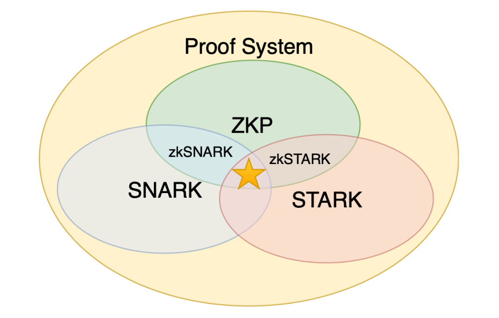

# 证明系统的性质

## 必要的性质

- **完整性 (Completeness)**：如果陈述 是正确的，而 Prover 和 Verifier 都遵守这个协议，那么 Verifier 以至少 的概率输出 accept，这里 被称为证明系统的**完整性误差 (Completeness error)**
- **可靠性 (Soundness)**：如果陈述 是不正确的，此时 Prover 必然是不诚实的，而 Verifier 遵守协议，那么任何 Prover 都不能让 Verifier 输出 accept 的概率超过 ，这个 被称为证明系统的**可靠性误差 (Soundness error)**

这两个要求是使得一个证明系统成立的最基本的要求。少了哪个要求，我们都可以得到符合条件但完全没用的证明系统。

例如，如果我们只要求完整性，那就无论 Prover 做什么，Verifier 永远只输出 accept 就好了；如果只要求可靠性，那就让 Verifier 永远只输出 reject。此外，一般希望 和 都不超过 ，并且加起来小于 ，否则这个证明系统误差太大，也近乎无用。

如果将一个证明系统的可靠性只对任何**计算能力受限的** Prover 成立，也就是说，计算能力无限的敌手是有可能欺骗 Verifier 的，此时这个证明系统只有**计算可靠性 (Computational Soundness)**，这样的系统又称为 **论证系统 (Argument System)**。相比之下，对任何 Prover 都安全的可靠性被称为**统计可靠性 (Statistical Soundness)**。

## 证明系统的其他性质

一个证明系统还可以满足一些其他(并非必需的)性质

- **CRS 模型 (CRS model)**：如果 Setup 信息是对所有人公开可见的，即 Setup=Setup_P=Setup_V，称这个证明系统是在 CRS 模型下的
- **交互 (Interactive) / 非交互 (Non-interactive)**：如果整个交互过程只有 Prover 向 Verifier 发送一条信息，就称这个系统是非交互证明系统；否则这个系统就是交互式证明系统
- **可迁移 (Transferable) / 可抵赖 (Deniable)**：如果陈述 x 是正确的，并且把交互过程发送给其他 Verifier，也能够让其他 Verifier 相信陈述 x 的正确性，这个证明系统就是可迁移的；否则这个证明系统就是可抵赖的
- **公开可验证 (Public Verifiable) / 特定验证者 (Designated Verifier)**：如果 Setup_V 是对所有人公开可见的，即任何人都可以成为 Verifier，这个零知识证明系统就是公开可验证的。否则这个系统就是针对特定验证者的
- **公开随机 (Public coin)**：如果 Verifier 的所有消息的选取都均匀随机且独立于 Prover 的消息，就称这个系统是公开随机的
- **零知识 (Zero-Knowledge)**：在陈述 x 是正确的情况下，如果除了 x 的正确性，Verifier 无法从交互中获取任何其他“知识”，就称这个系统是零知识的
- **简洁性 (Succinctness)**：如果这个证明系统是用来证明 NP 语言的，并且证明系统的通信量比证据 w 还要小，那么这个证明系统就具有简洁性

### 零知识性

**零知识性用来保护诚实的 Prover 不被恶意的 Verifier 欺骗而泄露证明所需的秘密证据。**

在一个证明系统的执行过程中，Verifier 获得的所有信息包括：Setup_V ；Verifier 自己的随机数 r ；Prover 发送给 Verifier 的所有信息 (记为 p )。我们把这些信息称为 Verifier 的“视野”，记为 View_V=(Setup_V,r,p) 。**这些信息是 Verifier 计算过程中的所有不确定性的来源**。确定了这些信息后，其他的一切都可以确定性地计算出来。

注意到，View_V 是一个随机变量。当 Verifier 与 Prover 执行了证明系统之后，Verifier 会获得这个随机变量的一个样本。如果 Verifier 能在没有 Prover 参与的情况下独自采样 View_V，那么这个系统就是零知识的。

### 简洁性

用 x 表示一个 NP 语言的实例， w 表示 x 存在语言中的证据。**简洁性 (Succinctness)** 是指一个证明系统所需的通信量低于 |w| 的线性函数。换句话说，Prover 和 Verifier 执行这个证明系统，比 Prover 直接把 w 发送给 Verifier，还要节省通信带宽。有时候，简洁性还可能要求 Verifier 在证明系统中的计算量要低于验证 w 。

### 非交互性

**非交互性 (Non-Interactivity)** 是指证明系统的全部交互只有 Prover 向 Verifier 发送的一条消息，这个消息叫做一个证明，记为 Pi 。非交互性可以带来许多的便利，为证明系统带来更多的应用场景。例如，在区块链系统中，非交互性的零知识证明可以附在交易中，供任何人随时查验，而不需要交易的作者随时在线与验证者交互。

## 例子

Setup 信息：有两个球

陈述 x ：这两个球颜色不同

Verifier 计算能力受限 (蒙上双眼)，Prover 具有正常的视力

1. Verifier 左右手各持一个球，展示给 Prover 看。
2. Verifier 把双手放到背后，接着 (在心里) 随机抛硬币，如果是正面朝上，就交换左右手里的球，否则不交换。
3. Verifier 把球拿出来给 Prover 看。
4. Prover 告诉 Verifier 两个球有没有交换。

结果：如果 Prover 猜对了，Verifier 输出 accept，否则 Verifier 输出 reject。

| 性质         | 讨论                                                         |
| :----------- | :----------------------------------------------------------- |
| 完整性       | 如果两球颜色不同，显然 Prover 一定能以百分之百的概率猜中 Verifier 有没有交换球 |
| 可靠性       | 如果两球颜色相同，那么 Prover 只能盲目猜测，只有 1/2 的概率猜中。这个系统的可靠性误差为 1/2 |
| CRS          | 这个证明系统是在 CRS 模型下的，因为 Setup 信息是公开的       |
| 交互性       | 这是个交互系统，因为 Prover 和 Verifier 互相发送的信息超过一条 |
| 可迁移性     | 这个系统是不可迁移的，即可抵赖的。即使 Verifier 把交互过程记录下来展示给其他蒙住眼的人，他们也不能确信两个球颜色不同 |
| 公开可验证性 | 这个系统是公开可验证的，任何 Verifier 都可以和 Prover 进行这个协议 |
| 公开随机性   | 这个系统不是公开随机的，因为 Verifier 发送给 Prover 的信息不是均匀随机的 |
| 零知识性     | 这个系统是零知识的，因为在两个球颜色确实不同的情况下，Prover 的猜测是 Verifier 意料之中的，除了表示陈述 x 的正确性外，没有任何额外知识 |